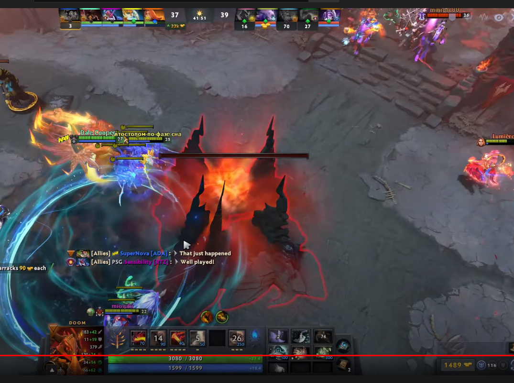

# DrawIt

A very simple painting app which is similar to Microsfot Paint. This is made using python3, with help of pygame module.

- Project Functionality and Key Features

  * `Basic Tools` - Contains basic tools like drawing line, boxes, bordered boxes, eraser, fill etc
  * `Save Drawing` - You can also save the picture you drew in .png format
  * `Load Picture` - Load Picture and then you can draw on it

